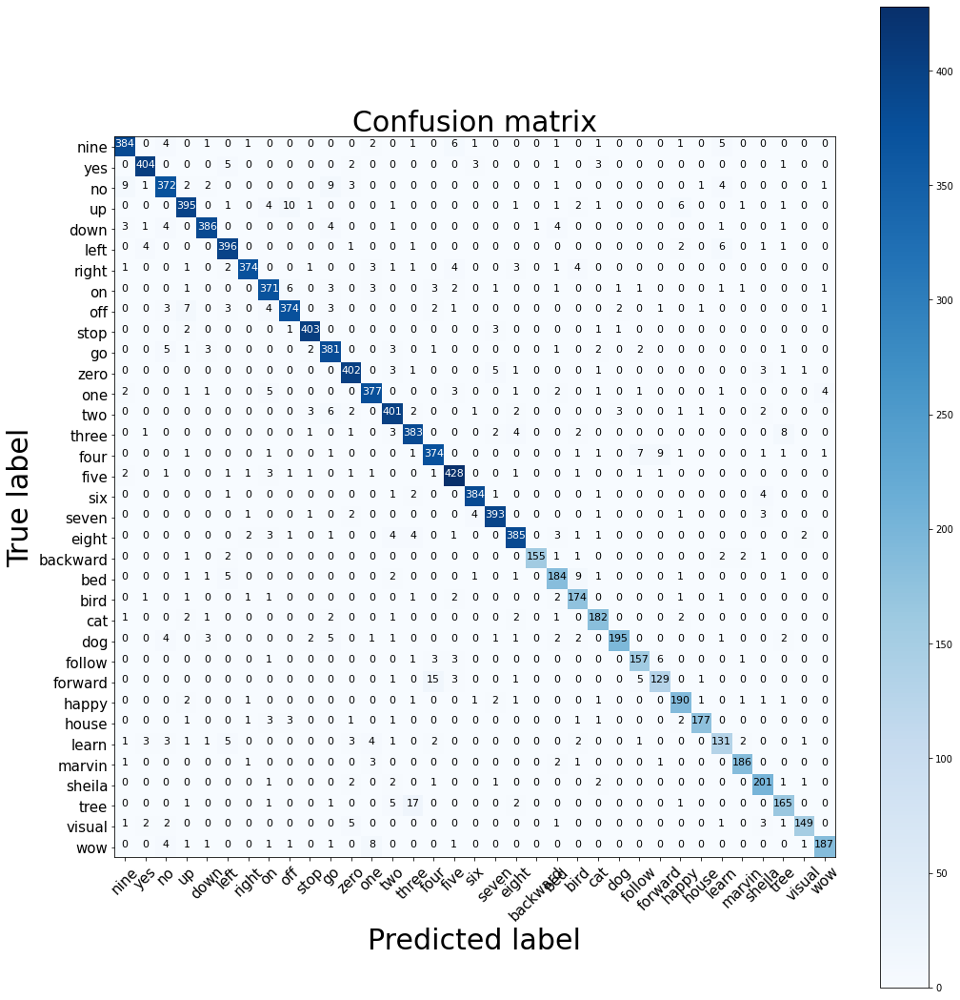

# Speech Command Recognition

## A Keras implementation of neural attention model for speech command recognition

This repository presents a recurrent attention model designed to identify keywords in short segments of audio. It has been tested using the Google Speech Command Datasets (v1 and v2).
For a complete description of the architecture, please refer to [paper](https://arxiv.org/abs/1808.08929).

Our main contributions are:

- A small footprint model (201K trainable parameters) that outperforms convolutional architectures for speech command recognition (AKA keyword spotting);
- A SpeechGenerator.py script that enables loading WAV files saved in .npy format from disk (like a Keras image generator, but for audio files);
- Attention outputs that make the model explainable (i.e., it is possible to identify what part of the audio was important to reach a conclusion).

# Attention Model

One usual problem with deep learning models is that they are usually "black-box" in the sense that it is very difficult to explain why the model reaches a certain decision. Attention is a powerful tool to make deep neural network models explainable: the picture below demonstrates that the transition from phoneme /a/ to phoneme /i/ is the most relevant part of the audio that the model used to decide (correctly) that the word is "right". Please refer to  [our paper](https://arxiv.org/abs/1808.08929) for confusion matrix and more attention plots.


# How to use this code

The Demo notebook is preconfigured with a set of tasks: ```['12cmd', 'leftright', '35word', '20cmd']```. Each of these refer to how many commands should be recognized by the model. When loading the Google Speech Dataset, the user should also select which version to download and use by adjusting the following line:

```gscInfo, nCategs = SpeechDownloader.PrepareGoogleSpeechCmd(version=1, task = '35word')```

- 35word task's classes:
    ``````
    #35word, v2
    classes = ['nine', 'yes', 'no', 'up', 'down', 'left', 'right', 'on', 'off', 'stop', 'go',
           'zero', 'one', 'two', 'three', 'four', 'five', 'six', 
           'seven',  'eight', 'backward', 'bed', 'bird', 'cat', 'dog',
           'follow', 'forward', 'happy', 'house', 'learn', 'marvin', 'sheila', 'tree',
           'visual', 'wow']
- Confuse matrix of 35word task:


## Cloning this repository

- Test trained model for task 35word:
  ``````
    python infer.py --record 1 #if you want to record your voice for testing
    python infer.py --audio a.wav #if you want to test audio file
  
- Convert model to TFlite (for deploy to mobile task)
  ``````
    python convert2Tflite.py
  
- Test TFlite model
  ``````
    python infer_tflite.py --record 1 #if you want to record your voice for testing
    python infer_tflite.py --audio a.wav #if you want to test audio file

### Test by [colab](https://drive.google.com/drive/folders/12yiH4c38uQA33wth9_EVLwXxJt_ZTX8J?usp=sharing)

open and run [infer.ipynb](https://colab.research.google.com/drive/1YdcZIj3plQs7aF-bJ8rT_i43d7zHfVQm?usp=sharing)
  
## Train with your own data

1. Generate data by text to speech + star GAN

1.1. Text to speech

   Check file `gen_data.py` and change text you want to generate
```
python gen_data.py
```
1.2. Use Star-GAN model to convert to 9 others voice
  Please check file `data4cmd.py` in [stargan-voice-conversion](http://gitlab.giaingay.io/vuthithao/stargan-voice-conversion)
  Run
```
python data4cmd.py
```

1.3. Train, test, val split
```
python traintestsplit.py
```

1.4. Config your cmd categories in file `SpeechPrepare.py`

1.5. Train
```
python train_custom.py
```
1.6. Test
```
python infer_custom.py --record 1
```

Thanks for: [douglas125](https://github.com/douglas125/SpeechCmdRecognition)
